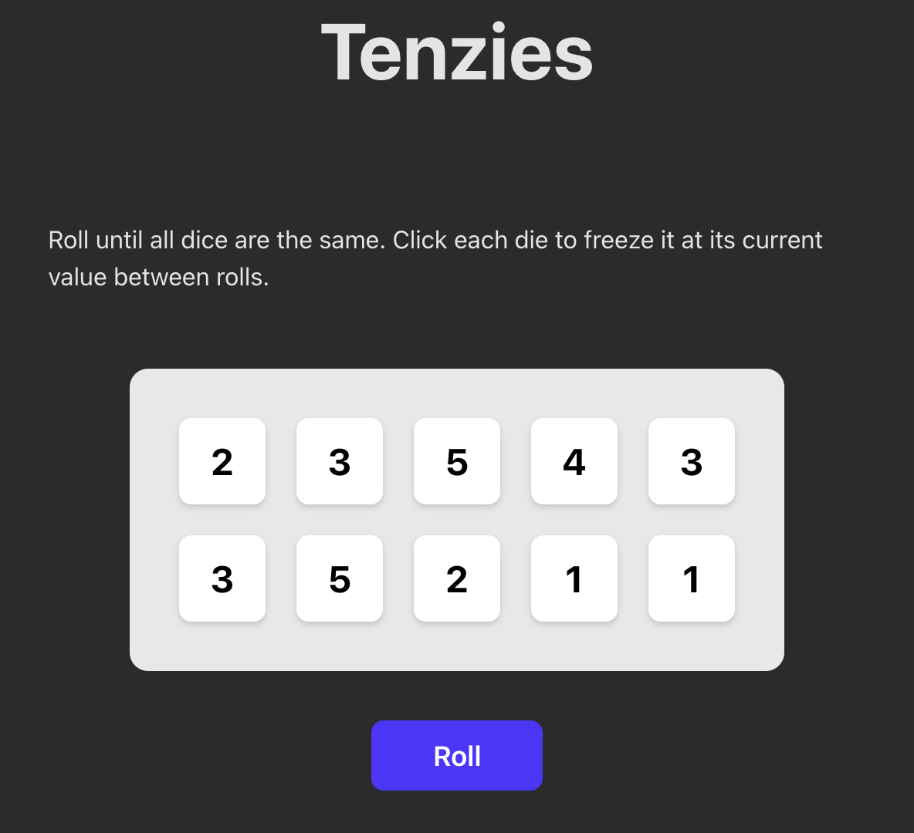

# Tenzies

A small dice game built with React + TypeScript + Vite. Roll until all ten dice show the same value—click a die to freeze it between rolls. This project showcases core React concepts learned during study.



---

## React concepts demonstrated

1. **`useState`** — Managing the game state (the array of dice with `value`, `id`, and `isHeld`) in the root component.

2. **Lazy initial state** — Using a function in `useState(() => generateNewDice())` so the initial dice are created once instead of on every re-render.

3. **Functional updates** — Using the updater form of `setState` (e.g. `setDice(oldDice => ...)` and `setDice(prev => ...)`) when the new state depends on the previous state, avoiding stale closures.

4. **Components & composition** — Splitting the UI into `App` (layout and game logic) and `Die` (single die UI), composed together.

5. **Props** — Passing data and behavior into `Die`: `id`, `value`, `isHeld`, and `onHold` for type-safe, reusable components.

6. **TypeScript interfaces** — Defining `DieProps` so component props are typed and easier to refactor.

7. **Conditional rendering** — Showing confetti only when the game is won (`{gameWon && <Confetti ... />}`) and switching the button label between "Roll" and "New Game".

8. **Rendering lists & `key`** — Mapping over `dice` to render `<Die>` components and using a stable `key={die.id}` for correct reconciliation and performance.

9. **Event handlers** — Using `onClick` to wire user actions (hold a die, roll / new game) to state updates.

10. **Lifting state up** — Keeping the dice state in `App` and passing it down to `Die`; child updates happen via callbacks (`onHold`) so the single source of truth stays in the parent.

11. **Controlled components** — Each `Die` is fully driven by props (`value`, `isHeld`); the parent owns the state and passes it down.

12. **Derived state** — `gameWon` is computed from `dice` (e.g. with `every`) instead of being stored in state, avoiding duplication and sync bugs.

13. **Immutability** — Updating state by returning new arrays/objects (e.g. `map` and spread `{ ...die }`) instead of mutating the existing state.

14. **JSX** — Using JSX for structure, `className`, and embedding expressions (`{value}`, `{gameWon ? 'New Game' : 'Roll'}`).

15. **React Strict Mode** — Wrapping the app in `<StrictMode>` in `main.tsx` to surface potential issues during development.

---

## Run locally

```bash
npm install
npm run dev
```

Build for production:

```bash
npm run build
npm run preview
```

---

## Stack

- **React 19** — UI library
- **TypeScript** — Typing
- **Vite** — Build tool and dev server
- **react-confetti** — Victory animation
